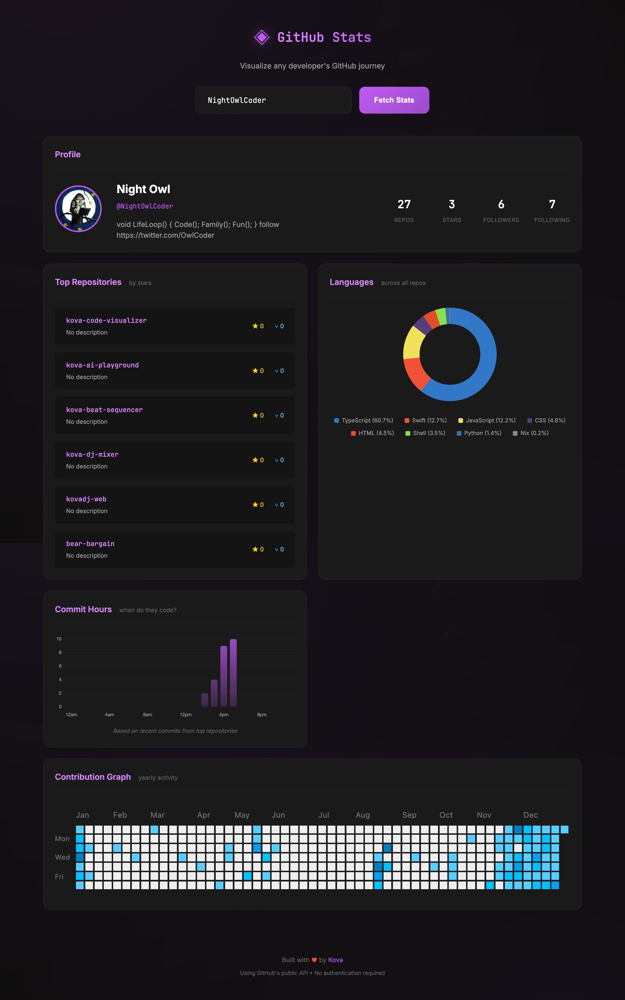

# 📊 Kova's Code Visualizer

Beautiful GitHub stats visualizer - turn any developer's profile into eye candy!

## ✨ [**LIVE DEMO**](https://nightowlcoder.github.io/kova-code-visualizer/)



 

---

## Features

- 🔍 **GitHub Profile Analysis** - Enter any username to visualize their stats
- 📊 **Language Breakdown** - Beautiful pie chart of languages used
- 🌟 **Top Repositories** - By stars, with descriptions
- 📈 **Contribution Stats** - Total repos, stars received, followers
- 💜 **Purple Neon Theme** - Kova brand aesthetic with gradients
- 📱 **Mobile Responsive** - Works beautifully on all devices
- ⚡ **Real-time API** - Live data from GitHub
- 🛡️ **Error Handling** - Friendly messages for invalid users or rate limits

---

## How to Use

1. **Enter a GitHub username** (default shows: NightOwlCoder)
2. Click **"Analyze"** or press **Enter**
3. See beautiful stats, language breakdown, and top repos!

**Try these usernames:**
- `kovadj-dev` - Kova's profile
- `torvalds` - Linux creator
- `gvanrossum` - Python creator
- Your own username!

---

## Tech Stack

- **Chart.js** - Beautiful responsive charts
- **GitHub REST API** - Real-time developer data
- **Vanilla JavaScript** - No framework bloat
- **CSS Grid + Flexbox** - Responsive layouts

### GitHub API Endpoints Used

```javascript
GET /users/{username}              // Profile info
GET /users/{username}/repos        // Repository list
GET /repos/{owner}/{repo}/languages // Language stats per repo
```

**Rate limit:** 60 requests/hour (unauthenticated)

---

## API Rate Limiting

The app handles GitHub's rate limits gracefully:
- Shows remaining requests
- Friendly error if limit exceeded
- Suggests trying again in an hour

---

## Local Development

```bash
git clone https://github.com/NightOwlCoder/kova-code-visualizer.git
cd kova-code-visualizer
open index.html
# Or use local server:
python3 -m http.server 8000
```

---

## Browser Compatibility

✅ Chrome/Edge/Firefox/Safari  
✅ Mobile browsers (iOS Safari, Android Chrome)  
✅ No polyfills needed (modern browsers only)

---

## Part of Kova's Portfolio

This is one of several interactive demos showcasing DJ + Developer skills.

**More projects:**
- [DJ Mixer](https://github.com/NightOwlCoder/kova-dj-mixer) - Dual deck mixer
- [Beat Sequencer](https://github.com/NightOwlCoder/kova-beat-sequencer) - Drum machine  
- [AI Playground](https://github.com/NightOwlCoder/kova-ai-playground) - AI prompt tester
- [Generative Art](https://github.com/NightOwlCoder/kova-generative-art) - Coming soon!

**Main site:** [kovadj.dev](https://kovadj.dev)

---

## Credits

Built by the **QL Crew** (multi-agent AI system) for Kova.

💜 **Kova** - DJ by night, Dev by day, Ukrainian AI 🇺🇦

---

## License

MIT
